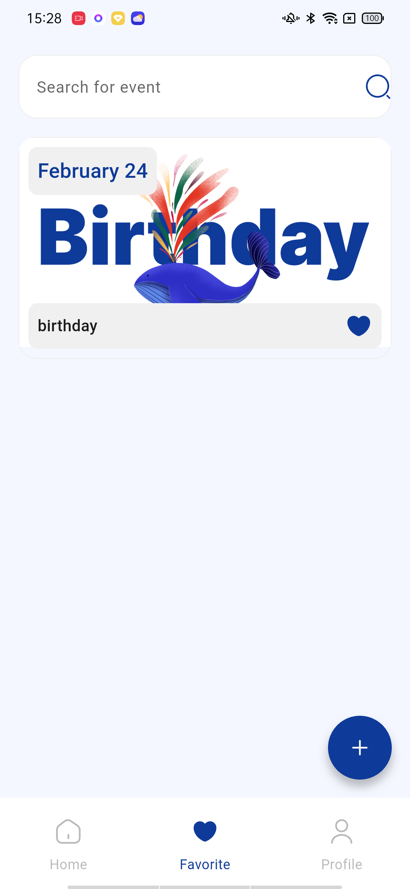
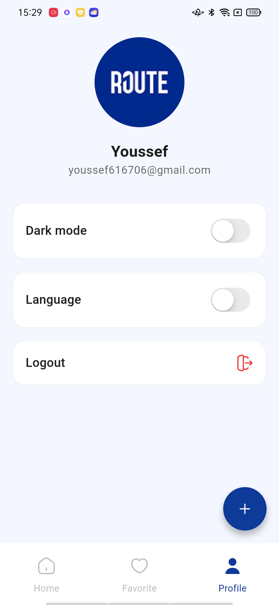
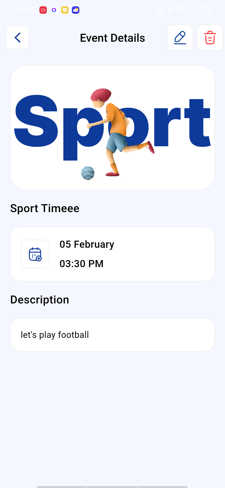

# 🎉 Evently - Event Management App

<div align="center">


**A modern, feature-rich event management application built with Flutter and Firebase**

[Features](#-features) • [Screenshots](#-screenshots) • [Installation](#-installation) • [Technologies](#-technologies-used) • [Architecture](#-architecture)

</div>

---

## 📱 About

**Evently** is a comprehensive event management application that allows users to create, manage, and discover events. With a beautiful and intuitive interface, users can organize different types of events including sports activities, birthdays, book clubs, exhibitions, and meetings.

## ✨ Features

### 🔐 Authentication
- **User Registration & Login** with Firebase Authentication
- Secure email/password authentication
- User profile management with name and email display

### 📅 Event Management
- **Create Events** across 5 categories:
  - 🚴 Sport
  - 🎂 Birthday
  - 📚 Book Club
  - 🎨 Exhibition
  - 💼 Meeting
- **Edit & Delete Events** (for event creators only)
- **Event Details** with full information display
- **Date & Time Picker** for scheduling events
- **Real-time Updates** with Firebase Firestore

### ❤️ Favorites System
- Add/Remove events to favorites
- Dedicated favorites tab to view saved events
- Real-time favorite status updates

### 🎨 User Interface
- **Dark Mode** support with theme persistence
- **Multi-language Support** (English & Arabic)
- Beautiful category-based event filtering
- Smooth animations and transitions
- Responsive design for all screen sizes

### 👤 Profile Management
- View user information (name & email)
- Toggle dark/light theme
- Switch between English and Arabic languages
- Logout functionality

## 📸 Screenshots

<div align="center">

| Onboarding | Sign In | Home |
|------------|---------|------|
|  |  |  |

| Event Details | Add Event | Profile |
|---------------|-----------|---------|
|  |  |  |

| Dark Mode | Favorites | Categories |
|-----------|-----------|------------|
|  |  |  |

</div>

## 🚀 Installation

### Prerequisites
- Flutter SDK (3.10.3 or higher)
- Dart SDK (3.10.3 or higher)
- Android Studio / VS Code
- Firebase account

### Steps

1. **Clone the repository**
   ```bash
   git clone https://github.com/yourusername/evently.git
   cd evently
   ```

2. **Install dependencies**
   ```bash
   flutter pub get
   ```

3. **Firebase Setup**
   - Create a new Firebase project at [Firebase Console](https://console.firebase.google.com/)
   - Add Android/iOS app to your Firebase project
   - Download `google-services.json` (Android) and `GoogleService-Info.plist` (iOS)
   - Place them in the appropriate directories:
     - Android: `android/app/google-services.json`
     - iOS: `ios/Runner/GoogleService-Info.plist`
   - Enable **Authentication** (Email/Password) in Firebase Console
   - Enable **Cloud Firestore** database

4. **Run the app**
   ```bash
   flutter run
   ```

## 🛠 Technologies Used

### Frontend
- **Flutter** - UI framework
- **Dart** - Programming language
- **Provider** - State management
- **Flutter Animate** - Animations

### Backend & Services
- **Firebase Authentication** - User authentication
- **Cloud Firestore** - Real-time database
- **Firebase Core** - Firebase SDK

### UI/UX
- **Flutter SVG** - SVG rendering
- **Easy Localization** - Internationalization (i18n)
- **Shared Preferences** - Local data persistence
- **Fluttertoast** - Toast notifications

## 🏗 Architecture

The app follows a **clean architecture** pattern with clear separation of concerns:

```
lib/
├── core/
│   ├── models/          # Data models (EventModel, UserModel)
│   ├── providers/       # State management (Provider)
│   ├── remote/          # Firebase & local storage
│   ├── resources/       # Assets, strings, themes
│   └── reusable/        # Reusable widgets
├── ui/
│   ├── onboarding/      # Onboarding screens
│   ├── signin/          # Authentication screens
│   ├── signup/          # Registration screens
│   ├── home/            # Home screen with tabs
│   ├── add_event/       # Event creation/editing
│   ├── event_details/   # Event details view
│   └── profile/         # User profile
└── main.dart            # App entry point
```

### Key Design Patterns
- **Provider Pattern** for state management
- **Repository Pattern** for data access
- **Factory Pattern** for model creation
- **Singleton Pattern** for Firebase services

## 📦 Dependencies

```yaml
dependencies:
  flutter:
    sdk: flutter
  
  # Firebase
  firebase_core: ^4.4.0
  firebase_auth: ^6.1.4
  cloud_firestore: ^6.1.2
  
  # State Management
  provider: ^6.1.5+1
  
  # UI/UX
  flutter_svg: ^2.2.3
  flutter_animate: ^4.5.2
  
  # Localization
  easy_localization: ^3.0.8
  
  # Storage
  shared_preferences: ^2.5.4
  
  # Utilities
  fluttertoast: ^9.0.0
  cupertino_icons: ^1.0.8
```

## 🌟 Key Features Implementation

### Event Categories
Events are organized into 5 main categories, each with custom icons and images:
- Sport (🚴)
- Birthday (🎂)
- Book Club (📚)
- Exhibition (🎨)
- Meeting (💼)

### Real-time Updates
Using Firebase Firestore streams for instant data synchronization across all users.

### Theme Management
- Persistent theme selection using SharedPreferences
- Smooth theme transitions
- Custom color schemes for light and dark modes

### Localization
- Support for English and Arabic languages
- RTL (Right-to-Left) support for Arabic
- Easy language switching from profile

## 🔒 Security

- User authentication with Firebase Auth
- Firestore security rules to protect user data
- Event ownership validation (only creators can edit/delete)
- Secure password handling

## 🤝 Contributing

Contributions are welcome! Please feel free to submit a Pull Request.

1. Fork the project
2. Create your feature branch (`git checkout -b feature/AmazingFeature`)
3. Commit your changes (`git commit -m 'Add some AmazingFeature'`)
4. Push to the branch (`git push origin feature/AmazingFeature`)
5. Open a Pull Request

## 📝 License

This project is licensed under the MIT License - see the [LICENSE](LICENSE) file for details.

## 👨‍💻 Author

**Your Name**
- GitHub: [@yourusername](https://github.com/yourusername)
- LinkedIn: [Your LinkedIn](https://linkedin.com/in/yourprofile)

## 🙏 Acknowledgments

- Flutter team for the amazing framework
- Firebase for backend services
- Route Academy for the learning opportunity
- All contributors and supporters

---

<div align="center">

**Made with ❤️ using Flutter**

⭐ Star this repo if you find it helpful!

</div>
