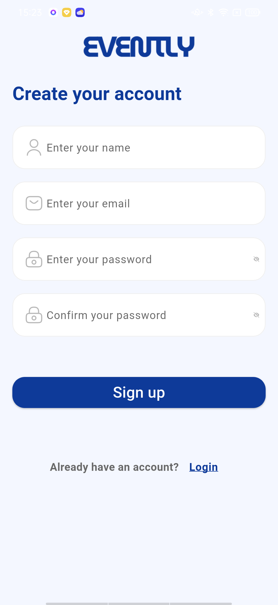
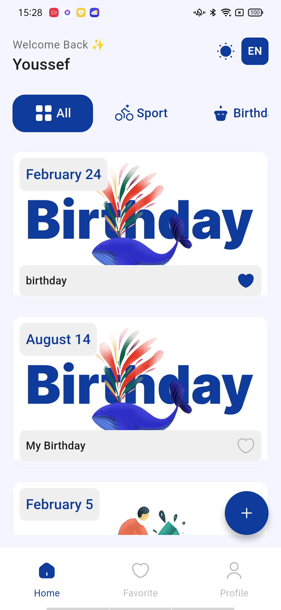
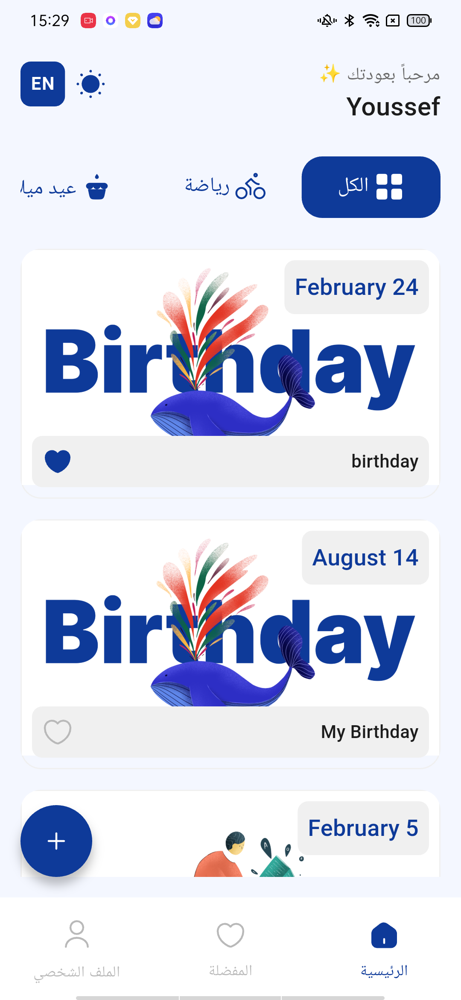
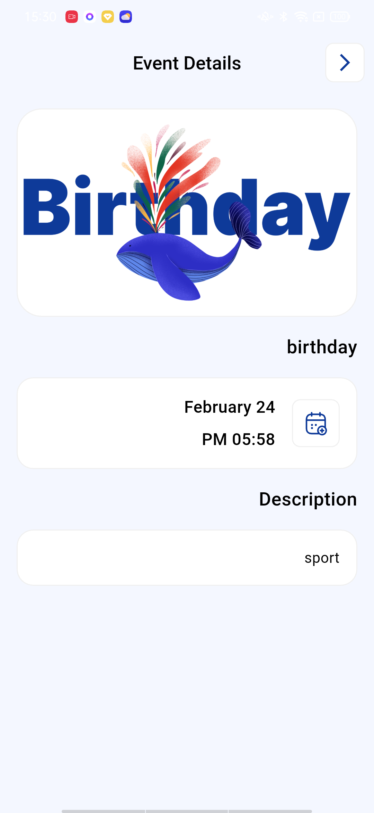
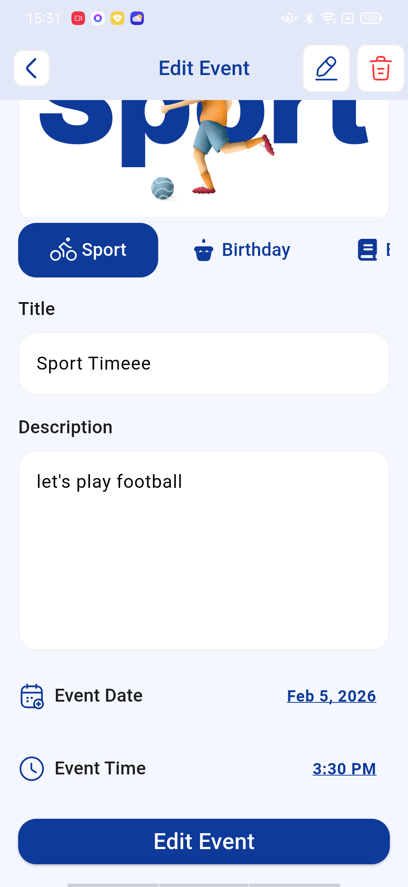

# 🎉 Evently - تطبيق إدارة الفعاليات

<div align="center" dir="rtl">


**تطبيق حديث ومتكامل لإدارة الفعاليات مبني بتقنية Flutter و Firebase**

</div>

---

## 📱 نبذة عن التطبيق

**Evently** هو تطبيق شامل لإدارة الفعاليات يتيح للمستخدمين إنشاء وإدارة واكتشاف الفعاليات المختلفة. بواجهة جميلة وسهلة الاستخدام، يمكن للمستخدمين تنظيم أنواع مختلفة من الفعاليات بما في ذلك الأنشطة الرياضية، أعياد الميلاد، نوادي الكتب، المعارض، والاجتماعات.

## ✨ المميزات

### 🔐 المصادقة والأمان
- **تسجيل الدخول والتسجيل** باستخدام Firebase Authentication
- مصادقة آمنة بالبريد الإلكتروني وكلمة المرور
- إدارة الملف الشخصي مع عرض الاسم والبريد الإلكتروني

### 📅 إدارة الفعاليات
- **إنشاء فعاليات** عبر 5 فئات:
  - 🚴 رياضة
  - 🎂 عيد ميلاد
  - 📚 نادي الكتاب
  - 🎨 معرض
  - 💼 اجتماع
- **تعديل وحذف الفعاليات** (لمنشئي الفعاليات فقط)
- **تفاصيل الفعالية** مع عرض كامل المعلومات
- **اختيار التاريخ والوقت** لجدولة الفعاليات
- **تحديثات فورية** باستخدام Firebase Firestore

### ❤️ نظام المفضلة
- إضافة/إزالة الفعاليات من المفضلة
- تبويب مخصص لعرض الفعاليات المحفوظة
- تحديثات فورية لحالة المفضلة

### 🎨 واجهة المستخدم
- **الوضع الليلي** مع حفظ الإعدادات
- **دعم متعدد اللغات** (العربية والإنجليزية)
- تصفية الفعاليات حسب الفئة
- رسوم متحركة سلسة وانتقالات جميلة
- تصميم متجاوب لجميع أحجام الشاشات

### 👤 إدارة الملف الشخصي
- عرض معلومات المستخدم (الاسم والبريد الإلكتروني)
- التبديل بين الوضع الليلي والنهاري
- التبديل بين اللغة العربية والإنجليزية
- خاصية تسجيل الخروج

## 📸 لقطات الشاشة

<div align="center">

  

  

  



</div>

## 🛠 التقنيات المستخدمة

### الواجهة الأمامية
- **Flutter** - إطار عمل واجهة المستخدم
- **Dart** - لغة البرمجة
- **Provider** - إدارة الحالة
- **Flutter Animate** - الرسوم المتحركة

### الخلفية والخدمات
- **Firebase Authentication** - مصادقة المستخدمين
- **Cloud Firestore** - قاعدة بيانات فورية
- **Firebase Core** - Firebase SDK

### واجهة المستخدم/تجربة المستخدم
- **Flutter SVG** - عرض ملفات SVG
- **Easy Localization** - الترجمة والتعريب
- **Shared Preferences** - حفظ البيانات محلياً
- **Fluttertoast** - إشعارات Toast

## 🚀 التثبيت والتشغيل

### المتطلبات
- Flutter SDK (3.10.3 أو أحدث)
- Dart SDK (3.10.3 أو أحدث)
- Android Studio / VS Code
- حساب Firebase

### خطوات التثبيت

1. **استنساخ المشروع**
   ```bash
   git clone https://github.com/YoussefCodez/evently.git
   cd evently
   ```

2. **تثبيت الحزم**
   ```bash
   flutter pub get
   ```

3. **إعداد Firebase**
   - إنشاء مشروع جديد في [Firebase Console](https://console.firebase.google.com/)
   - إضافة تطبيق Android/iOS إلى مشروع Firebase
   - تحميل `google-services.json` (Android) و `GoogleService-Info.plist` (iOS)
   - وضعهم في المجلدات المناسبة:
     - Android: `android/app/google-services.json`
     - iOS: `ios/Runner/GoogleService-Info.plist`
   - تفعيل **Authentication** (Email/Password) في Firebase Console
   - تفعيل **Cloud Firestore** database

4. **تشغيل التطبيق**
   ```bash
   flutter run
   ```

## 🏗 البنية المعمارية

التطبيق يتبع نمط **Clean Architecture** مع فصل واضح للمسؤوليات:

```
lib/
├── core/
│   ├── models/          # نماذج البيانات (EventModel, UserModel)
│   ├── providers/       # إدارة الحالة (Provider)
│   ├── remote/          # Firebase والتخزين المحلي
│   ├── resources/       # الأصول، النصوص، السمات
│   └── reusable/        # الويدجتات القابلة لإعادة الاستخدام
├── ui/
│   ├── onboarding/      # شاشات التعريف
│   ├── signin/          # شاشات تسجيل الدخول
│   ├── signup/          # شاشات التسجيل
│   ├── home/            # الشاشة الرئيسية مع التبويبات
│   ├── add_event/       # إنشاء/تعديل الفعاليات
│   ├── event_details/   # عرض تفاصيل الفعالية
│   └── profile/         # الملف الشخصي
└── main.dart            # نقطة بداية التطبيق
```

### أنماط التصميم المستخدمة
- **Provider Pattern** لإدارة الحالة
- **Repository Pattern** للوصول إلى البيانات
- **Factory Pattern** لإنشاء النماذج
- **Singleton Pattern** لخدمات Firebase

## 🌟 المميزات الرئيسية

### فئات الفعاليات
الفعاليات منظمة في 5 فئات رئيسية، كل منها مع أيقونات وصور مخصصة:
- رياضة (🚴)
- عيد ميلاد (🎂)
- نادي الكتاب (📚)
- معرض (🎨)
- اجتماع (💼)

### التحديثات الفورية
استخدام Firebase Firestore streams لمزامنة البيانات الفورية عبر جميع المستخدمين.

### إدارة السمات
- اختيار السمة الدائم باستخدام SharedPreferences
- انتقالات سلسة بين السمات
- أنظمة ألوان مخصصة للوضع النهاري والليلي

### التعريب
- دعم اللغتين العربية والإنجليزية
- دعم RTL (من اليمين إلى اليسار) للعربية
- تبديل سهل للغة من الملف الشخصي

## 🔒 الأمان

- مصادقة المستخدمين باستخدام Firebase Auth
- قواعد أمان Firestore لحماية بيانات المستخدمين
- التحقق من ملكية الفعالية (فقط المنشئون يمكنهم التعديل/الحذف)
- معالجة آمنة لكلمات المرور

## 📝 الترخيص

هذا المشروع مرخص بموجب ترخيص MIT - راجع ملف [LICENSE](LICENSE) للتفاصيل.

## 🙏 شكر وتقدير

- فريق Flutter على الإطار الرائع
- Firebase على خدمات الخلفية
- أكاديمية Route على فرصة التعلم
- جميع المساهمين والداعمين

---

<div align="center">

**صُنع بـ ❤️ باستخدام Flutter**

⭐ ضع نجمة للمشروع إذا أعجبك!

</div>
